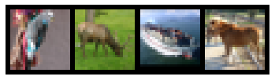
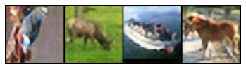
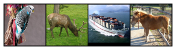

# GANs refined
In this week's lab, you used a GAN to generate images of people that look like celebrities.

For this homework, you will pick one of the GAN notebooks in this GitHub repo and modify it to improve the quality of the output: DCGan (the lab), Super Resolution GAN (SRGAN) and GauGAN. Look over the concepts, try to modify the parameters and observe the output. You will likely need to provision a T4-powered VM in the cloud to complete this work.

### Submission:
1. What changes did you make to the notebook[s]? Did your changes result in lower losses?
- Decreased Generator res_blocks to 8 from 16.
- Increased data loader batch size to 64 from 16.
- Changed learning rate to 1e-3
- Increased Generator blocks to 4 from 1.

Yes, the losses seemed to converge quicker and lower than the default notebook.

2. In your own words, how does the Discriminator improve its ability to detect fakes?
- The Generator improves its ability to detect fakes by attempting to minimize the KL Divergence between the Generator and Discriminator.  By entering a feedback loop with the Generator during training, both NN modules compete with one another to obtain the lowest loss possible by minimizing the KL Divergence in both probability distributions. 
3. Share a copy of the output image from the last step in the notebook (can be an upload to the ISVC Portal, or a link to the file in AWS Object Store).

